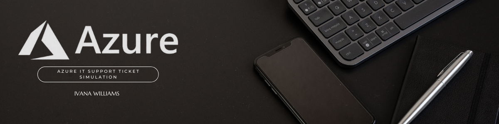

# Azure IT Support Ticket Simulation

## Project Overview
*This project demonstrates a simulated entry-level IT support workflow using Microsoft Azure, including issue investigation, safe validation steps, documentation, and cost-conscious resource cleanup. This simulation was performed in a non-production environment for training purposes.*
---

## Simulated Ticket Details

- **Ticket Name:** Azure Storage Account Setup and File Access Verification  
- **Ticket ID:** AZ-001  
- **Issue Type:** Cloud Storage Access / Configuration Verification  
- **Priority:** Medium  
- **Reported By:** End User  
- **Environment:** Microsoft Azure  

## Azure Resources Used
- **Resource Group:** rg-it-support-simulation

---

## Problem Description
*In this scenario, an end user requested verification of access to a file stored in an Azure Storage Account. I was tasked with validating the storage configuration, performing controlled test actions to confirm file access, and ensuring resources were managed safely and cost-effectively.*

---

## Tools & Technologies Used

- Microsoft Azure Portal

- Azure Resource Groups

- Azure Storage Account

- Azure Cost Management

- Windows Operating System

- Documentation and screenshots

---

## Actions Taken

1. Logged into the Azure Portal to verify account access
2. Created a Resource Group to isolate test resources
3. Created an Azure Storage Account within the resource group
4. Uploaded a test .txt file to an Azure storage container
5. Modified the test file in Azure to confirm write permissions
6. Downloaded the updated file to verify read access
7. Reviewed cost management to verify no unexpected charges
8. Deleted the Resource Group to remove all associated resources
   
---
## Evidence

- Screenshots are included below to document each step of the validation process, from resource creation to cleanup.
---

## Lessons Learned

*This assignment shows how Azure resources are organized and managed using Resource Groups. My goal was to demonstrate how I used cloud storage to practice safe access through controlled actions while following proper resource management.*

*I also learned how important it is to monitor costs and clean up unused resources. Overall, this project helped me understand the value of clear documentation in IT support workflows. Thank you for reading.*
